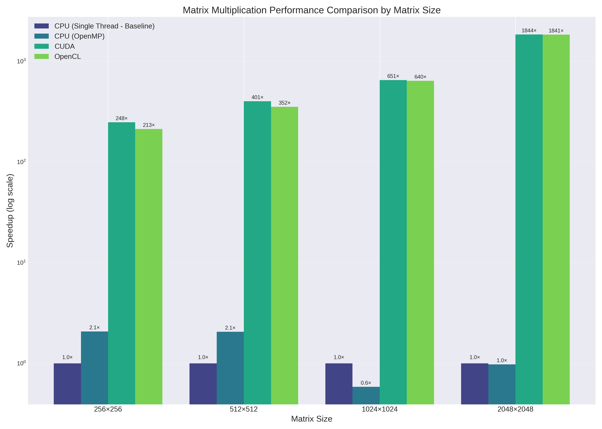
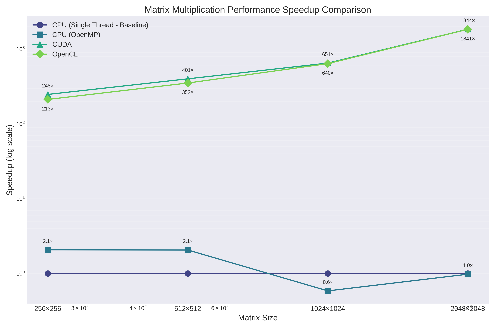
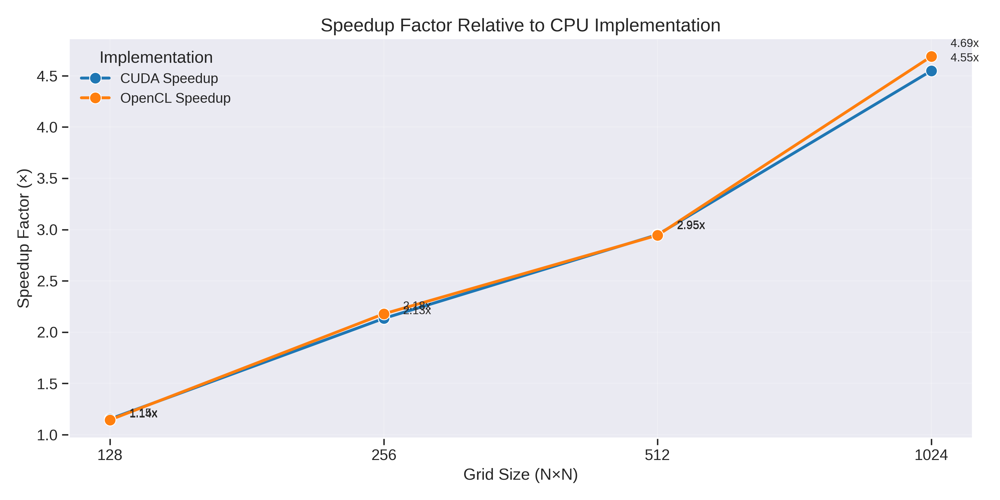

 # Parallel Computing Performance Analysis

A comparative study of CPU, OpenMP, CUDA, and OpenCL implementations for computationally intensive tasks.

## Overview

This project evaluates performance differences between parallel computing approaches:
- Single-threaded CPU execution
- Multi-threaded CPU using OpenMP
- GPU acceleration using CUDA
- GPU acceleration using OpenCL

Two primary computational problems were investigated:
1. Matrix multiplication (various sizes from 256×256 to 2048×2048)
2. Laplace equation solver (grid sizes from 128×128 to 1024×1024)

## Key Findings

### Matrix Multiplication

- OpenMP showed ~2x speedup for small matrices but degraded with larger matrices due to memory bandwidth limitations
- CUDA achieved dramatic speedups (918-3294x) compared to CPU implementations
- CUDA slightly outperformed OpenCL for large matrices, with the optimal thread block configuration being 32×4

### Laplace Equation Solver

- Both GPU implementations significantly outperformed CPU
- OpenCL showed slightly better performance than CUDA (4.69x vs 4.55x speedup)
- All implementations produced numerically equivalent results (verified with contour plots)

## Hardware Environment

- **CPU**: Intel Xeon with 2 vCPUs (2 cores) @ 2.20GHz, 13GB RAM
- **GPU**: NVIDIA Tesla T4 (40 SMs, 1024 max threads per block, 32 warp size)
  (Used Colab for both) 

#### All other verifications for the results mentioned in the pdf report. ####
